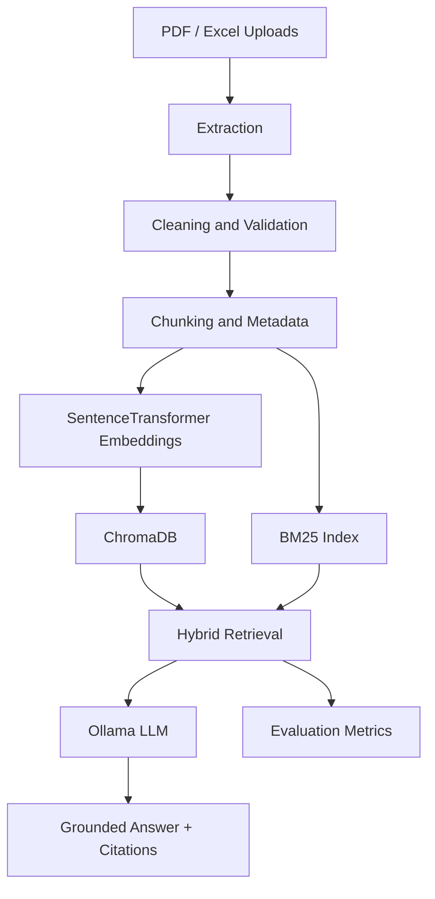

# Architecture

The app is specialized for the 2024CT05043 dissertation theme: intelligent knowledge extraction from unstructured enterprise data using RAG evaluation frameworks. It implements the requested PDF and Excel portion of the broader multimodal concept.
